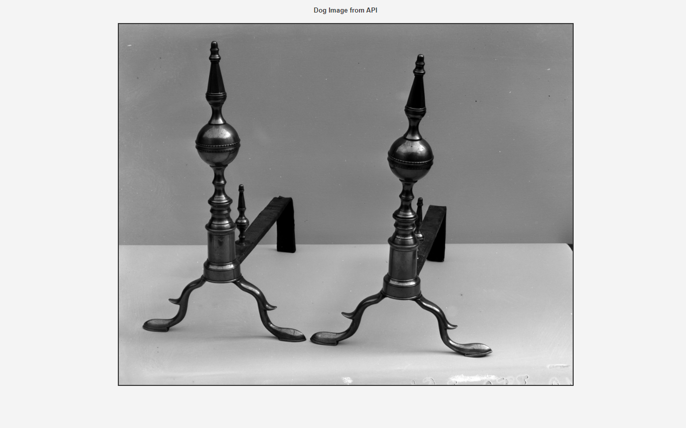

# 📚 Consumo de API com fetch
Este projeto é uma Prova de Conceito (POC) que demonstra como consumir uma API para buscar e exibir imagens de cães aleatórias usando JavaScript e o método `fetch`.

## 📃 Funcionamento básico da API
Para o consumo de dados da API, é necessário construir uma URL com base na documentação da API. Neste caso, foi utilizado o seguinte endpoint:
```
https://collectionapi.metmuseum.org/public/collection/v1/objects/110
```
Podemos adicionar ainda propriedades, como o ID de um objeto específico ou filtros de pesquisa. A função recebe esses valores como argumento e os repassa para o endpoint como parâmetros da requisição:
https://collectionapi.metmuseum.org/public/collection/v1/objects/${objectID}

A resposta dessa requisição contém um objeto JSON com a seguinte formatação:

```
{
  "objectID": 110,
  "isHighlight": false,
  "accessionNumber": "41.160.374",
  "accessionYear": "1941",
  "isPublicDomain": true,
  "primaryImage": "https://images.metmuseum.org/CRDImages/ad/original/126257.jpg",
  "primaryImageSmall": "https://images.metmuseum.org/CRDImages/ad/web-large/126257.jpg",
  "additionalImages": [],
  "constituents": [
    {
      "constituentID": 1090,
      "role": "Maker",
      "name": "James Davis",
      "constituentULAN_URL": "",
      "constituentWikidata_URL": "",
      "gender": ""
    }
```
## Funcionalidades
- Busca de uma imagem aleatória de API.
- Exibição da imagem no navegador.
- Botão para atualizar a imagem com uma nova, gerada aleatoriamente.

## 💻 Tecnologias Utilizadas
- **HTML5**: Estrutura básica da página.
- **CSS3**: Estilização da página.
- **JavaScript**: Lógica de busca da API e manipulação do DOM.
- **Dog API**: API pública para buscar imagens de cães aleatórias.

## Como Funciona
O projeto utiliza a (https://metmuseum.github.io/) para obter uma imagem aleatória. A API retorna um objeto JSON com a URL da imagem, que é usada para exibir a imagem na página.

### Exemplo de Resposta da API:
```json
{
  "message": "https://images.dog.ceo/breeds/hound-afghan/n02088094_1003.jpg",
  "status": "success"
}
```

## Instalação e Execução
1. Faça o clone deste repositório para o seu ambiente local.
2. Abra o arquivo `index.html` em seu navegador.
3. Clique no botão "Get Random Dog" para buscar e exibir uma nova imagem.

## Estrutura do Projeto
- **index.html**: Contém a estrutura da página e inclui o script e o CSS.
- **styles.css**: Define a estilização da página.
- **script.js**: Contém o código JavaScript que faz a chamada à API e exibe as imagens.

### Exemplo de Código
#### HTML:
```html
<button onclick="getRandomDogImage()">Get Random Dog</button>
```

#### JavaScript:
```javascript
function getRandomDogImage() {
    fetch('https://dog.ceo/api/breeds/image/random')
        .then(response => response.json())
        .then(data => {
            const img = document.createElement('img');
            img.src = data.message;
            document.getElementById('image-container').innerHTML = '';
            document.getElementById('image-container').appendChild(img);
        });
}
```
## 🌆 Resultado visual
O código presente neste repositório, quando executado em um navegador apresenta o versículo no centro da página, como mostra a imagem a seguir:



### :family: Integrantes do Projeto

|  <br> <sub> Yasmin Mendes </sub> |  <br> <sub> Bruna Zakaib </sub> |  <br> <sub> Isabela Realli </sub> |  <br> <sub> Beatriz Soares </sub> |
| --- | --- | --- | --- |
| [Yasmin Mendes](https://github.com/YasminMSouza) | [Bruna Zakaib](https://github.com/brunazpessoa) | [Isabela Realli](https://github.com/IsabelaReali) | [Beatriz Soares](https://github.com/Beatriz-sol) |

Licença 📝
Esse projeto está autorizado pelo MIT

